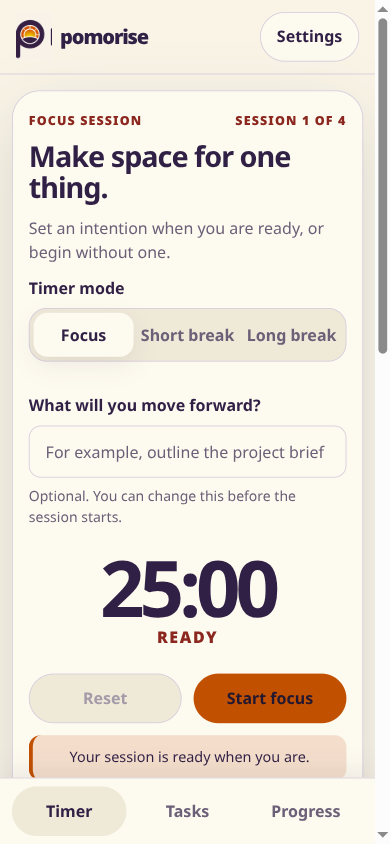
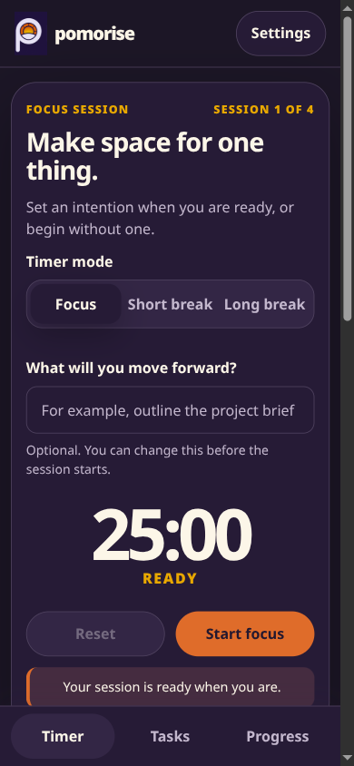
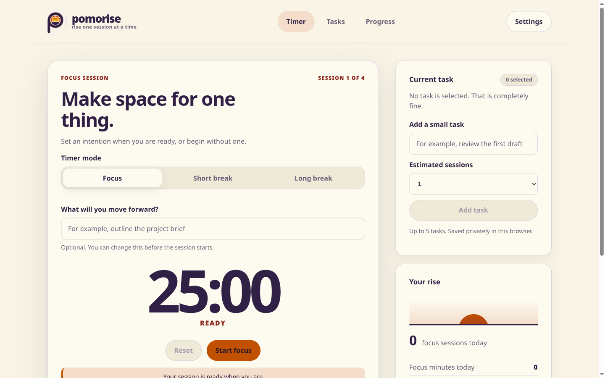
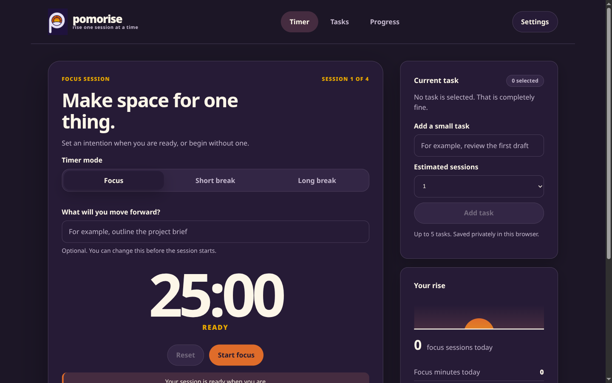
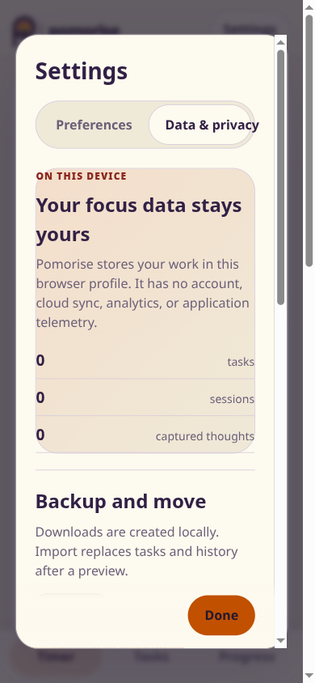
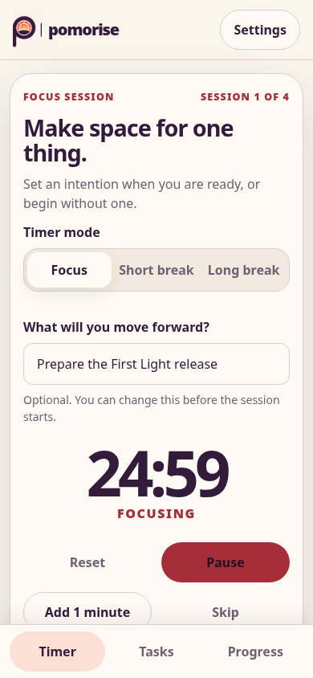
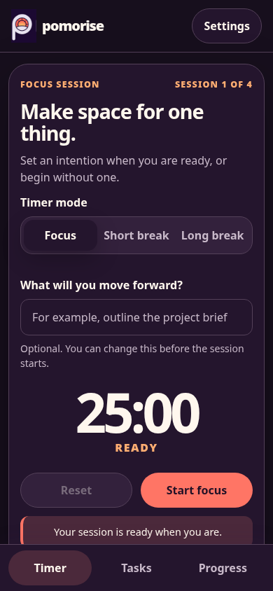
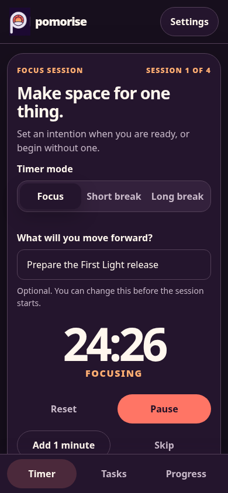
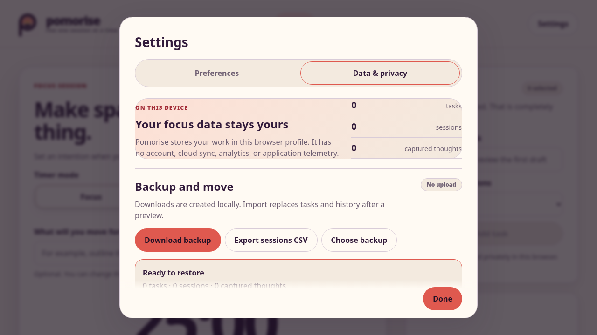
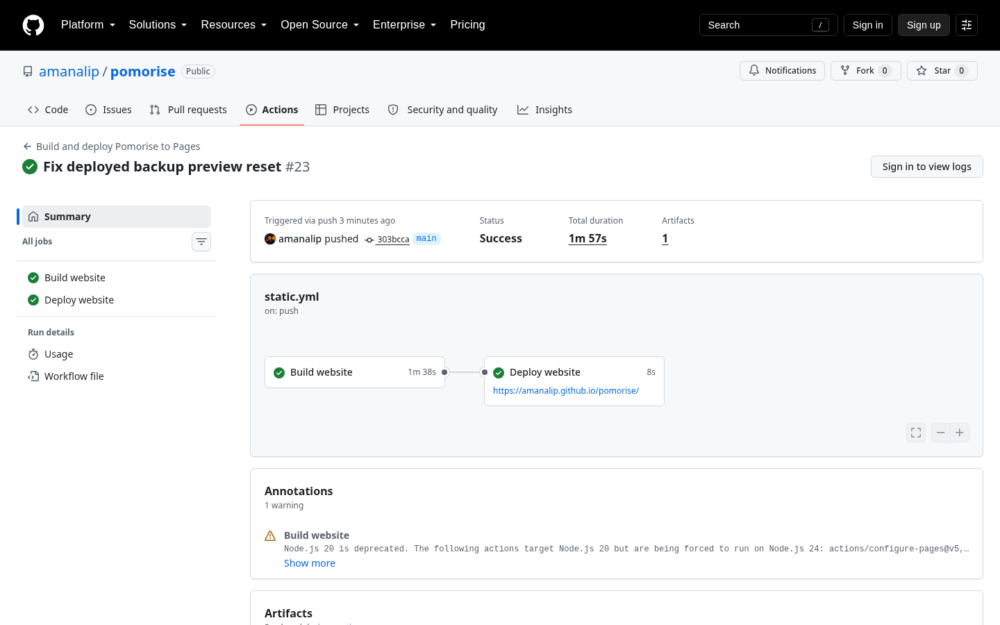

# Pomorise 1.0: First Light Final Comprehensive Test Report

| Document information | Value |
| --- | --- |
| Report identifier | `final-comprehensive-suite` |
| Report status | **Passed** |
| Created | August 20, 2026 at 6:17:53 PM EDT |
| Last updated | August 20, 2026 at 7:04:00 PM EDT |
| ISO 8601 created | `2026-08-20T18:17:53-04:00` |
| ISO 8601 last updated | `2026-08-20T19:04:00-04:00` |
| Timezone | America/Toronto (UTC-04:00) |
| Estimated reading time | 18 minutes |
| Prepared by | Aman Ali with Codex collaboration |
| Verification status | Release gate passed with documented platform limitations |

## Table of contents

- [Executive result](#executive-result)
- [Scope and acceptance criteria](#scope-and-acceptance-criteria)
- [Change under test](#change-under-test)
- [Covered development documents](#covered-development-documents)
- [Test environment](#test-environment)
- [Synthetic test data](#synthetic-test-data)
- [Tools and versions](#tools-and-versions)
- [Command log](#command-log)
- [Automated test results](#automated-test-results)
- [Manual test results](#manual-test-results)
- [Accessibility results](#accessibility-results)
- [Responsive and theme results](#responsive-and-theme-results)
- [Privacy, network, and storage results](#privacy-network-and-storage-results)
- [Offline and update results](#offline-and-update-results)
- [Performance results](#performance-results)
- [Comment coverage audit](#comment-coverage-audit)
- [Failures, defects, and retests](#failures-defects-and-retests)
- [Screenshot index](#screenshot-index)
- [Logs and artifacts](#logs-and-artifacts)
- [Known limitations and residual risks](#known-limitations-and-residual-risks)
- [Mandatory closeout checklist](#mandatory-closeout-checklist)
- [Conclusion](#conclusion)

## Executive result

| Result summary | Value |
| --- | --- |
| Overall result | **Passed** |
| Started | August 20, 2026 at 6:17:53 PM EDT |
| Finished | August 20, 2026 at 7:04:00 PM EDT |
| Total duration | 46 minutes 7 seconds, including fixes, retests, deployment, and documentation closeout |
| Final automated cases | 70 passed, 0 failed, 0 blocked, 1 skipped, 0 flaky |
| Final manual cases | 16 passed, 0 failed, 0 blocked, 1 skipped |
| Defects resolved during suite | 4 application defects, 3 test or infrastructure corrections |
| Required screenshots | Light, dark, mobile, desktop, data controls, deployed flow, and runner summary |
| Screenshots retained | 10 |
| Phase 7 release gate | Passed |

Pomorise 1.0 passed its clean local suite, Chromium and Firefox production-browser suite, three-run mobile performance profile, dependency audit, production build, gated GitHub Actions deployment, and public-site smoke review. The public review found one real asynchronous backup-preview defect. It was fixed in `303bcca`, covered by a regression assertion, redeployed, and retested successfully. No known failing release behavior remains.

## Scope and acceptance criteria

### Included scope

- The complete choose, focus, capture, recover, reflect, and progress experience.
- Timestamp-based timer recovery, page refresh, browser restart, and clock-change handling.
- IndexedDB schema version two, version-one migration, persistence, backup, restore, CSV export, scoped deletion, and preference reset.
- Keyboard semantics, accessible names, automated axe analysis, responsive reflow, light and dark themes, and reduced motion behavior.
- PWA manifest, service worker, offline reload, update consent, notification denial, cache contents, error recovery, and GitHub Pages paths.
- Dependency, asset, bundle, runtime-request, privacy-language, and performance review.
- The public release at [amanalip.github.io/pomorise](https://amanalip.github.io/pomorise/).

### Excluded scope

- Cloud sync, accounts, analytics, server storage, collaboration, and native mobile packaging are outside First Light.
- Native Safari/WebKit execution was skipped because the local CachyOS host lacks WebKit's Ubuntu compatibility libraries and the GitHub workflow intentionally supports Chromium and Firefox. This is recorded as a limitation, not claimed as tested coverage.
- A dedicated screen-reader application was unavailable. Accessibility coverage used the browser accessibility tree, semantic role snapshots, keyboard interaction, visible focus review, axe, and responsive inspection.

### Acceptance criteria

- [x] A clean CI run completes without ignored failures. See AUTO-001 through AUTO-010.
- [x] The public URL, refresh, and repository-relative assets load correctly. See MAN-009 and MAN-010.
- [x] Runtime requests remain on the approved GitHub Pages origin. See AUTO-055 and MAN-013.
- [x] The privacy promise matches observed local storage and network behavior. See AUTO-041 through AUTO-055.
- [x] A fresh visitor can begin and recover a focus session. See AUTO-021 through AUTO-036 and MAN-001 through MAN-004.
- [x] Compatible synthetic version-one data migrates without losing visitor wording. See AUTO-037.
- [x] Accessibility and responsive checks pass within the tested support matrix. See AUTO-047 through AUTO-054 and MAN-005 through MAN-008.
- [x] Public backup, restore preview, replacement, and delete-everything controls pass. See MAN-014 through MAN-016 and DEF-004.

## Change under test

| Change information | Value |
| --- | --- |
| Commit hash | `303bcca934489c53b279fb6dc63e493992553d99` |
| Short commit | `303bcca` |
| Branch | `main` |
| Dirty worktree during final deployed checks | Report artifacts only; application source was clean at the deployed commit |
| Pull request | None |
| Build mode | Production and deployed GitHub Pages |
| Application URL | `https://amanalip.github.io/pomorise/` |
| Previous comparison point | Phase 6 commit `6bd3702` |

The release candidate combines Phases 1 through 6, local-data completion, hydration-race protection, startup performance optimization, release version `1.0.0`, and the deployed backup-preview correction.

## Covered development documents

- [Phase 1 foundation](../../development_docs/phase-01-foundation/doc.md)
- [Phase 2 design system and shell](../../development_docs/phase-02-design-system-shell/doc.md)
- [Phase 3 reliable timer](../../development_docs/phase-03-reliable-timer-engine/doc.md)
- [Phase 4 focus loop](../../development_docs/phase-04-complete-focus-loop/doc.md)
- [Phase 5 local data and privacy](../../development_docs/phase-05-local-data-and-privacy-controls/doc.md)
- [Phase 6 offline and quality hardening](../../development_docs/phase-06-offline-and-quality-hardening/doc.md)
- [Phase 7 release verification](../../development_docs/phase-07-release-verification-publication/doc.md)

## Test environment

| Environment information | Value |
| --- | --- |
| Operating system | CachyOS Linux, kernel `7.1.8-1-cachyos` |
| Architecture | x86_64 |
| Node.js | 24.18.1 |
| npm | 12.0.2 |
| Browser engines | Chrome for Testing 151.0.7922.34; Firefox 153.0 |
| Viewports | 390 by 844, 768 by 1024, 1280 by 720, 1440 by 900 |
| Color themes | Light, dark, and system preference |
| Reduced motion | Default and `prefers-reduced-motion: reduce` |
| Locale | English |
| Test timezone | America/Toronto |
| Network mode | Online, browser-forced offline, Lighthouse mobile throttling |
| Storage state | Fresh, seeded, migrated, restored, deleted, and reopened |
| Notification permission | Default and denied |
| Persistent storage | Declined response verified; unsupported fallback covered |

## Synthetic test data

| Data set | Purpose | Records | Sensitive-data review | Cleanup result |
| --- | --- | --- | --- | --- |
| Synthetic release workspace | Migration, import, deletion, reflection, and progress | 1 task, 1 session, 1 distraction, 1 reflection | Invented wording only | Deleted by test isolation |
| Public smoke workspace | Deployed timer and ownership controls | Intention `Prepare the First Light release`; empty exported record sets | Invented wording only | Delete-everything returned all counts to zero |
| Malformed backup | Safe rejection | Invalid JSON string | No personal data | Rejected without writes |

No real visitor tasks, reflections, identifiers, secrets, or signed-in browser data were used.

## Tools and versions

| Tool | Version | Purpose |
| --- | --- | --- |
| TypeScript | 6.0.3 | Strict type checking |
| ESLint | 10.8.1 | Source and test linting |
| Prettier | 3.9.6 | Formatting verification |
| Vitest | 4.1.11 | Unit and component behavior |
| Playwright | 1.62.1 | Production-browser and deployed smoke checks |
| axe-core Playwright | 4.13.0 | Automated accessibility analysis |
| Lighthouse | Installed CLI used by logs 018 through 027 | Three-run mobile performance profile |
| Vite | 8.2.2 | Production build and preview |
| vite-plugin-pwa | 1.3.0 | Manifest and service-worker generation |

## Command log

The raw logs include their own command, start timestamp, finish timestamp, duration, and exit code. Every failure was retained rather than overwritten.

| Command ID | Command | Final result | Raw log |
| --- | --- | --- | --- |
| CMD-001 | `npm ci` | Passed; transitive `glob` deprecation warning retained | [028-final-clean-install.txt](logs/028-final-clean-install.txt) |
| CMD-002 | `npm run format:check` | Passed | [029-final-format.txt](logs/029-final-format.txt) |
| CMD-003 | `npm run lint` | Passed | [030-final-lint.txt](logs/030-final-lint.txt) |
| CMD-004 | `npm run typecheck` | Passed | [031-final-typecheck.txt](logs/031-final-typecheck.txt) |
| CMD-005 | `npm run test:unit` | 7 files and 20 tests passed | [032-final-unit.txt](logs/032-final-unit.txt) |
| CMD-006 | `npm run test:component` | 2 files and 6 tests passed | [033-final-component.txt](logs/033-final-component.txt) |
| CMD-007 | `npm run build` | Passed | [034-final-build.txt](logs/034-final-build.txt) |
| CMD-008 | Full Chromium and Firefox browser suite | Initial attempt blocked by occupied preview port | [035-final-browser.txt](logs/035-final-browser.txt) |
| CMD-009 | Full browser suite retest | 36 of 36 passed | [036-final-browser-retest.txt](logs/036-final-browser-retest.txt) |
| CMD-010 | `npm audit` | Passed with 0 vulnerabilities | [037-final-audit.txt](logs/037-final-audit.txt) |
| CMD-011 | Production artifact listing and size | Passed, 936,393 bytes total | [038-dist-files.txt](logs/038-dist-files.txt), [039-dist-size.txt](logs/039-dist-size.txt) |
| CMD-012 | Three final Lighthouse mobile profiles | Passed | [025](logs/025-lighthouse-final-1.txt), [026](logs/026-lighthouse-final-2.txt), [027](logs/027-lighthouse-final-3.txt) |
| CMD-013 | Version `1.0.0` format and lint | Passed | [041](logs/041-release-version-format.txt), [042](logs/042-release-version-lint.txt) |
| CMD-014 | Mistyped `npm run test:run` | Failed because that script does not exist | [043-release-version-tests.txt](logs/043-release-version-tests.txt) |
| CMD-015 | Correct unit, component, and build retest | 20 unit and 6 component tests passed; build passed | [045](logs/045-release-version-unit.txt), [046](logs/046-release-version-component.txt), [047](logs/047-release-version-build.txt) |
| CMD-016 | Backup-fix browser check | First attempt blocked by sandbox localhost restriction | [050-restore-fix-browser.txt](logs/050-restore-fix-browser.txt) |
| CMD-017 | Backup-fix browser retest outside restricted network namespace | 10 of 10 Chromium and Firefox cases passed | [052-restore-fix-browser-retest.txt](logs/052-restore-fix-browser-retest.txt) |
| CMD-018 | Final GitHub Actions workflow and deployment | Passed at commit `303bcca` | [053-final-github-actions.txt](logs/053-final-github-actions.txt) |
| CMD-019 | Closeout format, lint, unit, and production build | Passed; 20 unit tests and final build remained green | [054](logs/054-closeout-format.txt), [055](logs/055-closeout-lint.txt), [056](logs/056-closeout-unit.txt), [057](logs/057-closeout-build.txt) |
| CMD-020 | Release-document local link audit | All targets existed across seven release documents | [058-closeout-links.txt](logs/058-closeout-links.txt) |

## Automated test results

| Case IDs | Layer | Cases | Actual result | Result | Evidence |
| --- | --- | --- | --- | --- | --- |
| AUTO-001 to AUTO-020 | Unit | Timer transitions, storage, schemas, migration helpers, focus calculations, writing rules | 20 passed | Passed | [032-final-unit.txt](logs/032-final-unit.txt) |
| AUTO-021 to AUTO-026 | Component | Accessible controls, hydration readiness, focus journey, error recovery | 6 passed | Passed | [033-final-component.txt](logs/033-final-component.txt) |
| AUTO-027 to AUTO-062 | Browser | Timer recovery, local data, offline, network, accessibility, permissions, responsive behavior | 36 passed in Chromium and Firefox | Passed | [036-final-browser-retest.txt](logs/036-final-browser-retest.txt) |
| AUTO-063 | Formatting | All configured files | Matched Prettier style | Passed | [029-final-format.txt](logs/029-final-format.txt) |
| AUTO-064 | Lint | Source, tests, and configuration | No warnings or errors | Passed | [030-final-lint.txt](logs/030-final-lint.txt) |
| AUTO-065 | Types | Strict project type graph | No errors | Passed | [031-final-typecheck.txt](logs/031-final-typecheck.txt) |
| AUTO-066 | Build | Pages-path production artifact | Build and PWA generation succeeded | Passed | [034-final-build.txt](logs/034-final-build.txt) |
| AUTO-067 | Dependencies | Installed dependency graph | 0 known vulnerabilities | Passed | [037-final-audit.txt](logs/037-final-audit.txt) |
| AUTO-068 | Asset budgets | Full `dist` and initial JS | 0.89 MiB precache and 89.23 KiB initial JS gzip | Passed | [034-final-build.txt](logs/034-final-build.txt) |
| AUTO-069 | Performance | Three mobile Lighthouse runs | Median score 97, LCP 2.453 s, CLS 0, TBT 75 ms | Passed | [025](logs/025-lighthouse-final-1.txt), [026](logs/026-lighthouse-final-2.txt), [027](logs/027-lighthouse-final-3.txt) |
| AUTO-070 | Deployment | Gated Pages workflow | Build and deployment passed | Passed | [053-final-github-actions.txt](logs/053-final-github-actions.txt) |
| AUTO-071 | WebKit | Native engine launch | Skipped due missing host compatibility libraries | Skipped | [Phase 5 limitation](../../development_docs/phase-05-local-data-and-privacy-controls/doc.md) |

Final totals: 70 passed, 0 failed, 0 blocked, 1 skipped, and 0 flaky.

## Manual test results

| Case ID | Requirement and actions | Actual result | Result | Evidence |
| --- | --- | --- | --- | --- |
| MAN-001 | Load a fresh mobile timer | Primary Start focus action is visible without scrolling | Passed | [Screenshot 001](screenshots/001-mobile-light.png) |
| MAN-002 | Enter an intention and start | Timer enters Focusing with coherent controls | Passed | [Screenshot 006](screenshots/006-public-mobile-running.png) |
| MAN-003 | Refresh a running public timer | Intention and running timer recovered at 24:59 | Passed | Public Playwright smoke notes |
| MAN-004 | Review pause, add-minute, skip, and capture controls | Controls remain readable and reachable | Passed | [Screenshot 006](screenshots/006-public-mobile-running.png) |
| MAN-005 | Inspect keyboard order and focus | Skip link, header, timer, supporting cards, settings, and dialog order are logical | Passed | Playwright role snapshots and browser review |
| MAN-006 | Review mobile light and dark presentation | Contrast, hierarchy, selected states, and sticky navigation remain clear | Passed | [001](screenshots/001-mobile-light.png), [002](screenshots/002-mobile-dark.png) |
| MAN-007 | Review desktop light and dark presentation | Balanced two-column layout with clear primary hierarchy | Passed | [003](screenshots/003-desktop-light.png), [004](screenshots/004-desktop-dark.png) |
| MAN-008 | Review data controls at constrained height | Dialog scroll, actions, counts, and privacy explanation remain usable | Passed | [005](screenshots/005-mobile-data-controls.png), [009](screenshots/009-public-import-preview.png) |
| MAN-009 | Direct-load public repository path | Page title, shell, styles, images, and assets load | Passed | Public smoke and [010](screenshots/010-github-actions-passed.png) |
| MAN-010 | Refresh public route | No base-path or missing-asset failure | Passed | Public Playwright smoke notes |
| MAN-011 | Select dark mode, close settings, refresh | `html[data-theme]` remains `dark` | Passed | [007](screenshots/007-public-mobile-dark.png) |
| MAN-012 | Force browser offline and reload | Installed app shell and timer reopen from cache | Passed | [008](screenshots/008-public-mobile-offline.png) |
| MAN-013 | Inspect public performance entries | Only `https://amanalip.github.io` appeared; external request list was empty | Passed | Public Playwright smoke notes |
| MAN-014 | Download public backup | Valid version-one JSON backup downloaded locally | Passed | [public-backup.json](artifacts/public-backup.json) |
| MAN-015 | Re-import backup, preview, and replace | Preview appeared, file input cleared, replacement completed | Passed after DEF-004 retest | [009](screenshots/009-public-import-preview.png) |
| MAN-016 | Confirm delete-everything | Counts returned to 0 tasks, 0 sessions, and 0 captured thoughts | Passed | Public Playwright smoke notes |
| MAN-017 | Dedicated native screen-reader walkthrough | Reader application unavailable in this environment | Skipped | RISK-002 |

## Accessibility results

| Check | Method | Actual | Result |
| --- | --- | --- | --- |
| Keyboard order and focus | Manual keyboard and semantic browser snapshots | Logical order, skip link, visible controls, and dialog focus behavior | Passed |
| Accessible names | Testing Library and Playwright roles | Every exercised control had an accurate role and name | Passed |
| Automated scan | axe in Chromium and Firefox production builds | No serious or critical WCAG A/AA findings | Passed |
| Reflow | 390 by 844 through 1440 by 900 | No representative horizontal overflow; core CTA remains visible | Passed |
| Reduced motion | Media emulation and CSS review | No meaning depends on animation | Passed |
| Dedicated screen reader | Native reader application | Not available | Skipped |

## Responsive and theme results

| Case ID | Viewport | Theme | Expected | Actual | Result |
| --- | --- | --- | --- | --- | --- |
| VIEW-001 | 390 by 844 | Light | Start action and mode controls above sticky navigation | Fully visible and unclipped | Passed |
| VIEW-002 | 390 by 844 | Dark | Equivalent hierarchy and readable contrast | Equivalent behavior and clear states | Passed |
| VIEW-003 | 1440 by 900 | Light | Calm primary timer with supporting cards | Balanced and readable | Passed |
| VIEW-004 | 1440 by 900 | Dark | No palette or asset mismatch | Correct dark identity and contrast | Passed |
| VIEW-005 | Constrained settings dialog | Light | Data controls remain scrollable and understandable | Sections and sticky Done action remain usable | Passed |

The final UX correction shortened first-screen copy, tightened vertical rhythm, kept timer modes horizontal on mobile, and removed the non-actionable offline-ready toast that previously obscured the core action. The final visual review found no remaining release-blocking UX issue.

## Privacy, network, and storage results

### Network requests

| Request ID | Origin | Personal data | Approved | Result |
| --- | --- | --- | --- | --- |
| NET-001 | `https://amanalip.github.io` | No | Yes, static host | Passed |
| NET-002 | Any third-party origin | None observed | No third-party origin approved | Passed, list empty |

### Storage observations

| Store | Action | Expected and actual | Result |
| --- | --- | --- | --- |
| IndexedDB version 1 to 2 | Open compatible older workspace | Wording preserved; new fields initialized | Passed |
| IndexedDB structured records | Import synthetic backup | Atomic replacement only after validated preview | Passed |
| IndexedDB history | Clear history | Tasks preserved; sessions, reflections, and captures removed | Passed |
| IndexedDB all focus data | Delete everything | All structured counts zero; preferences preserved | Passed |
| localStorage preferences | Reset preferences | Timer and appearance defaults restored without deleting focus data | Passed |
| Cache Storage | Inspect generated caches | Only application assets, no intentions or personal records | Passed |

The observed behavior matches the privacy promise: Pomorise application data stays in browser storage unless the visitor explicitly downloads a file. GitHub may retain normal static-host infrastructure records, as disclosed by the product documentation.

## Offline and update results

| Case ID | Starting state | Change | Actual recovery | Result |
| --- | --- | --- | --- | --- |
| OFF-001 | Installed online shell | Browser forced offline and page reloaded | Timer shell reopened and remained usable | Passed |
| OFF-002 | Running timer | Refresh | Timestamp state and intention recovered | Passed |
| OFF-003 | Update available | New worker waiting | UI requests visitor consent; no automatic active-session reload | Passed |
| OFF-004 | Notification permission denied | Visitor enables notification option | Calm denial guidance, no timer failure | Passed |

## Performance results

| Measurement | Budget | Observed median | Result |
| --- | --- | --- | --- |
| Lighthouse mobile score | At least 90 | 97 | Passed |
| Largest Contentful Paint | At most 2.5 s | 2.453 s | Passed |
| Cumulative Layout Shift | At most 0.1 | 0 | Passed |
| Total Blocking Time | At most 200 ms | 75 ms | Passed |
| Interaction-to-next-paint proxy | At most 200 ms | Chromium 16.90 ms; Firefox 35.00 ms | Passed |
| Initial JS gzip | At most 175 KiB | 89.23 KiB | Passed |
| Complete `dist` | At most 1.25 MiB | 936,393 bytes | Passed |

Lighthouse did not emit field INP because the navigation profile contains no natural user interaction. The deterministic browser interaction-to-next-paint proxy is retained as a release signal, not misrepresented as field INP.

## Comment coverage audit

| Scope | Method | Missing or stale comments | Result |
| --- | --- | --- | --- |
| TypeScript, TSX, CSS, configuration, workflow, and tests | Project writing rule tests plus manual diff review | None observed in changed release lines | Passed |
| JSON and other non-comment formats | Companion annotations | Required package and TypeScript annotations present | Passed |

## Failures, defects, and retests

### DEF-001: Firefox exposed delayed-save deletion race

- **Symptom:** A delayed workspace save could repopulate records after deletion.
- **Cause:** An earlier debounced save survived the destructive transaction boundary.
- **Fix:** A synchronous persistence epoch invalidates stale saves when a workspace mutation begins.
- **Retest:** Ten local-data cases and the full browser suite passed in Chromium and Firefox.

### DEF-002: Startup hydration could overwrite immediate planning text

- **Symptom:** Typing immediately after first paint could be overwritten by later IndexedDB hydration.
- **Fix:** Structured planning controls remain disabled until hydration completes.
- **Retest:** Component coverage and all 36 browser cases passed.

### DEF-003: Initial mobile performance missed the LCP budget

- **Symptom:** The first three-run median LCP was about 2.75 seconds.
- **Fix:** Data controls, Dexie, and Zod moved into lazy chunks; hydration begins after 300 ms; service-worker registration begins after 1.5 seconds.
- **Retest:** Final median LCP was 2.453 seconds with score 97 and CLS 0.

### DEF-004: Deployed backup preview cleared a released event target

- **First observed:** August 20, 2026 at 6:47 PM EDT during MAN-015.
- **Symptom:** The validated preview state was prepared, then production logged `Cannot set properties of null` while clearing the file input.
- **Cause:** `event.currentTarget` was accessed after `await file.text()`.
- **Fix:** Retain the input element before the asynchronous boundary and clear that stable reference. Add a browser assertion that the native file value returns to empty.
- **Commit:** `303bcca934489c53b279fb6dc63e493992553d99`.
- **Retest:** 10 Chromium and Firefox data cases passed; GitHub Actions passed; the deployed preview appeared; input value was empty; replacement and deletion completed.

### Harness and infrastructure corrections

- A first full browser run exposed DEF-002 and was retained in [008-browser-tests.txt](logs/008-browser-tests.txt).
- The final browser command first met an occupied preview port, then passed 36 of 36 after the stale server ended.
- A release-version command used the nonexistent `test:run` script; the intended unit and component commands passed separately.
- A sandboxed localhost preview received `EPERM`; the same regression suite passed outside that restricted network namespace.
- Two Playwright CLI scripts were split after automation timeouts. Their smaller deployed checks completed successfully.

None of these original failures was erased.

## Screenshot index

| Screenshot | Captured | Case | Viewport | Theme | Observed state |
| --- | --- | --- | --- | --- | --- |
| [001](screenshots/001-mobile-light.png) | Aug 20, 2026 6:17 PM EDT | MAN-001 | 390 by 844 | Light | Fresh CTA visible |
| [002](screenshots/002-mobile-dark.png) | Aug 20, 2026 6:17 PM EDT | MAN-006 | 390 by 844 | Dark | Fresh CTA visible |
| [003](screenshots/003-desktop-light.png) | Aug 20, 2026 6:17 PM EDT | MAN-007 | 1440 by 900 | Light | Balanced workspace |
| [004](screenshots/004-desktop-dark.png) | Aug 20, 2026 6:17 PM EDT | MAN-007 | 1440 by 900 | Dark | Balanced workspace |
| [005](screenshots/005-mobile-data-controls.png) | Aug 20, 2026 6:17 PM EDT | MAN-008 | 390 by 844 | Light | Data ownership dialog |
| [006](screenshots/006-public-mobile-running.png) | Aug 20, 2026 6:44 PM EDT | MAN-002 | 390 by 844 | Light | Public focus timer running |
| [007](screenshots/007-public-mobile-dark.png) | Aug 20, 2026 6:45 PM EDT | MAN-011 | 390 by 844 | Dark | Public theme persisted |
| [008](screenshots/008-public-mobile-offline.png) | Aug 20, 2026 6:46 PM EDT | MAN-012 | 390 by 844 | Dark | Cached timer after offline reload |
| [009](screenshots/009-public-import-preview.png) | Aug 20, 2026 6:52 PM EDT | MAN-015 | 1280 by 720 | Light | Fixed public restore preview |
| [010](screenshots/010-github-actions-passed.png) | Aug 20, 2026 6:52 PM EDT | AUTO-070 | 1440 by 900 | GitHub | Build and deploy jobs succeeded |

## Logs and artifacts

- All raw command output is retained in [`logs/`](logs/).
- Performance details are retained as Lighthouse JSON files in [`artifacts/`](artifacts/) and in logs 018 through 027.
- Public browser captures are retained in [`screenshots/`](screenshots/).
- The synthetic downloaded backup contains only empty record arrays and release metadata.
- Screenshots and logs were reviewed for secrets, unrelated tabs, access tokens, and personal records. None were retained. GitHub's deployment log masks its OIDC token.

## Known limitations and residual risks

| ID | Limitation | User impact | Current control | Follow-up owner |
| --- | --- | --- | --- | --- |
| RISK-001 | Native Safari/WebKit not executed | A Safari-specific issue could remain | Standards-based implementation; Chromium and Firefox coverage; explicit support note | Maintainer when a compatible macOS or Ubuntu WebKit host is available |
| RISK-002 | No dedicated screen-reader application walkthrough | A reader-specific announcement issue could remain | Semantic roles, accessible names, keyboard review, browser tree, and axe pass | Maintainer with NVDA, VoiceOver, or Orca environment |
| RISK-003 | GitHub's official Pages actions emit a Node 20 deprecation annotation while forced onto Node 24 | No current visitor impact | Workflow succeeds using pinned official actions | Maintainer when GitHub publishes updated action runtimes |
| RISK-004 | Transitive `glob@11.1.0` emits a deprecation warning | No known vulnerable package according to `npm audit` | Lockfile, clean install, and audit retained | Maintainer during routine dependency updates |
| RISK-005 | Lighthouse lab results are environment-sensitive | Visitor devices may differ | Three-run median and bundle budgets retained | Maintainer at future release gates |

## Mandatory closeout checklist

- [x] Approved scope and deviations are documented.
- [x] Every covered development document is linked.
- [x] Every Phase 7 acceptance criterion has evidence.
- [x] Changed human-authored code follows the commenting standard.
- [x] Companion annotations remain present.
- [x] Automated commands retain timestamps, exit codes, results, and raw logs.
- [x] Manual checks contain reproducible actions and observations.
- [x] Failures, retries, the WebKit skip, and infrastructure corrections are explicit.
- [x] Accessibility, responsive, theme, privacy, network, storage, offline, update, and performance findings are recorded.
- [x] Screenshots are embedded and passed a sensitive-data review.
- [x] Known limitations and residual risks are explicit.
- [x] The conclusion matches the detailed totals.
- [x] `testreports/README.md` links to this report.
- [x] Project documentation and changelog are synchronized in the Phase 7 closeout commit.
- [x] All blocking items passed, so the Phase 7 release gate may close.

## Conclusion

**Passed.**

The evidence supports publishing Pomorise 1.0: First Light. The complete supported-browser suite is green, the public Pages deployment works at its repository path, the main focus loop and recovery paths are reliable, data ownership controls complete their promised scopes, runtime requests remain same-origin, offline reopening works, the final performance profile meets its budgets, and the final UX review shows a clear primary action across light, dark, mobile, and desktop states.

The skipped native WebKit and dedicated screen-reader checks remain explicit residual risks. They do not conceal a known failing behavior, and no blocking defect remains after the deployed backup-preview retest.
